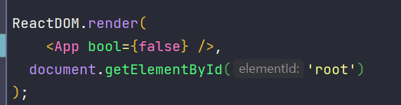
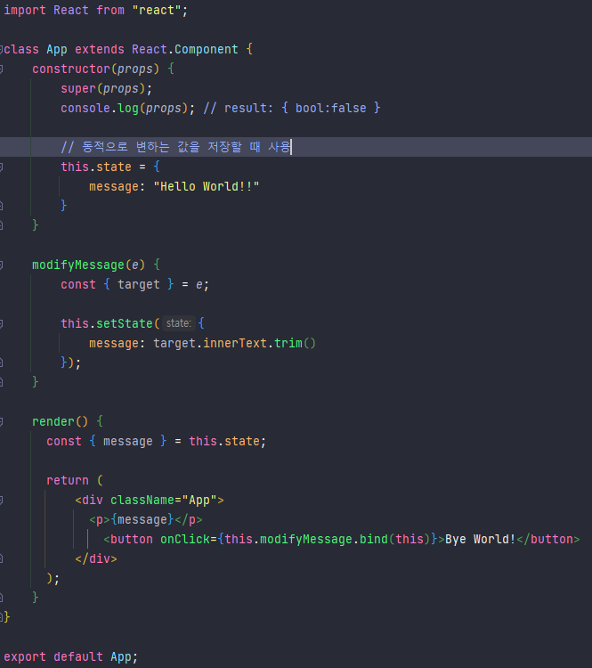

---

paginate: true
marp: true
theme: my-theme

---


# :pencil2: 리액트 기본 사용법

###### 기술연구소 윤장혁

---

# 목차

1. 사전지식
   1. class
   2. 객체, 배열 구조 분해 할당이란
2. 리액트 기본 사용법
   1. 작성법

---

# 1. Javascript의 class

Java, C++ 등에 잇는 클래스를 사용한 문법에 익숙한 프로그래머들의 좀 더 빠른 학습을 도와주기 위해 도입된 ES6 문법.
<br />
<br />
<br />
> ###### ES6란? "ECMAScript6 or ES2015"를 줄인말로 모든 브라우저에서 사용되는 javascript의 문법(사용 규칙) 표준화?

---

```javascript

class App {
   name = "";

   constructor(name) { // 생성될 때 실행되는 함수
      this.name = name;
   }

   get name() {
      return this.name;
   }

   set name(name) {
      // app.name = value를 실행할때 실행되는 코드
      this.name = name;
   }
}

const app = new App("hello");
console.log(app.name); // result: "hello"

```

---

## 1-1. extends와 super

```javascript
class Animal {
   constructor(height, weight) {
      this.height = height;
      this.weight = weight;
   }
}

class Bird extends Animal {
   constructor(height, weight, color) {
      super(height, weight);
      this.color = color;
   }
}

const bird = new Bird(3, 6, 'blue');
console.log(bird.height, bird.color); // result: 3, 'blue'
```

---

# 2. 배열, 객체 구조분해 할당

MDN 정의에 따르면 **배열이나 객체의 속성을 해체하여 그 값을 개별 변수에 담을 수 있게 하는 Javascript 표현식**이라고 나와있다.

--- 

## 2-1. 배열 구조분해 할당

```javascript
const word_arr = ["Apple", "Banana", "Orange"];

const [apple, banana, orange] = word_arr;

console.log(apple, banana, orange); // result: "Apple", "Banana", "Orange" 
```

---

## 2-2. 객체 구조분해 할당

```javascript
const word_object = {
   "apple": "Apple",
   "banana": "Banana",
   "orange": ["BlackOrange", "RedOrange"]
};

const { apple, banana, orange } = word_object;

console.log(apple, banana, orange); // result: "Apple", "Banana", ["BlackOrange", "RedOrange"] 
```

<br />
<br />

>  - javascript에서의 객체(object)는 0개 이상의 요소(property)로 구성된 집합.
>  - 요소(property)는 키(key)와 값(value)로 구성되어있다.

---

# 3. 리액트 기본 사용법





---

 - 클릭 전


 - 클릭 후


---

# 감사합니다.