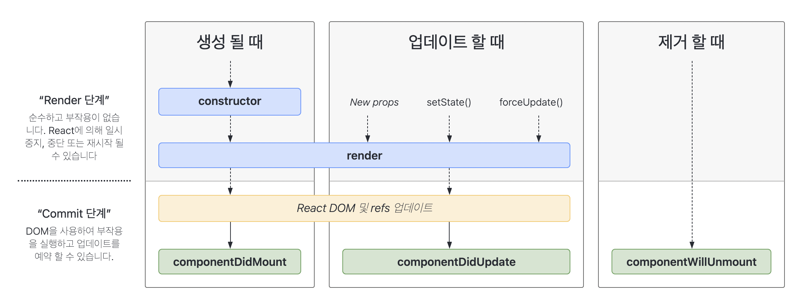

---

paginate: true
marp: true
theme: my-theme

---

# 리액트 생명주기

기술연구소 윤장혁

---

# 목차

1. 리액트 컴포넌트 생명주기 정의
  1.1 컴포넌트 생명주기 공부이유
2. 전체적인 과정

---

# 3. 리액트 컴포넌트 생명주기

`컴포넌트 생명주기(lifecycle)`란 컴포넌트가 페이지 렌더링 되기 위해 준비하는 과정부터 제거될 때까지의 기간을 뜻한다.
클래스형 컴포넌트는 이러한 생명주기 중 특정 시점에 대해 원하는 구문을 실행할 수 있도록 `생명주기 메서드`를 지원한다.

---

## 3.1 컴포넌트 생명주기 공부 이유
<br />
- 어디에 어떤 코드를 정확히 넣어야 하는지 알기 위해서

   - ex) "API 불러올 코드 작성 위치", "컴포넌트 생성 전·후에 특정 값 추가하려 할 때"
- 리액트 특징중 하나가 "컴포넌트 방식으로 작성하는것"인데 이 컴포넌트의 생명주기는 그래도 알아야 하지 않을까..

---



---

## Mounting(생성 될 때)
<br />
1. constructor()
2. getDerivedStateFromProps() // render() 함수 호출 직전 실행되는 함수
3. render()
4. componentDidMount()

---


### constructor()
<br />
- 컴포넌트가 만들어질 때 가장 먼저 실행되는 메서드

```javascript
constructor(props) {
    super(props);
}
```

---

### getDerivedStateFromProps()
<br />
props를 통해 받아온 값을 state에 넣어주고 싶을 때 사용한다.

```javascript
  static getDerivedStateFromProps(nextProps, prevState) {
    console.log("getDerivedStateFromProps");
    if (nextProps.color !== prevState.color) {
      return { color: nextProps.color };
    }
    return null;
  }
```

> 다른 생명주기 메서드와는 달리 앞에 `static`을 필요로하고, 여기선 this를 조회할 수 없다.
> 여기서 특정 객체를 반환시 그 객체의 내용이 컴포넌트의 state로 바뀐다. / null 반환시 적용 안됨.

---

### render()
<br />
컴포넌트를 렌더링하는 메서드.

```javascript
render() {
    const text = "Hi";
    
    return (<h1>{text}</h1>);
}
```

---

### componentDidMount()
<br />
컴포넌트의 첫번째 렌더링이 마친 후 실행되는 함수. 이 메서드 호출 시점에는 우리가 만든 컴포넌트가
화면에 나타난 상태다.
여기선 주로 DOM을 사용해야하는 외부 라이브러리 연동, ajax, fetch, axios 등 요청을 하거나,
DOM의 속성을 읽거나 직접 변경하는 작업을 진행한다.

---

## UPDATING

- getDerivedStateFromProps()
- shouldComponentUpdate()
- render()
- getSnapshotBeforeUpdate()
- componentDidUpdate()

---

### getDerivedStateFromProps()
<br />

아까 Mount 과정에서 설명한 함수로 컴포넌트의 props나 state가 바뀌었을때도 이 메서드가 실행된다.

---

### shouldComponentUpdate()
<br />

컴포넌트가 리렌더링 할지 말지 결정하는 메서드

```javascript
  shouldComponentUpdate(nextProps, nextState) {
    console.log("shouldComponentUpdate", nextProps, nextState);
    // 숫자의 마지막 자리가 4면 리렌더링하지 않습니다
    return nextState.number % 10 !== 4;
  }
```

---

### render()
<br />

컴포넌트를 렌더링하는 메서드.

```javascript
render() {
    const text = "Hi";
    
    return (<h1>{text}</h1>);
}
```

---

### getSnapshotBeforeUpdate()
<br />

컴포넌트에 변화가 일어나기 직전의 DOM 상태를 가져와 특정 값을 반환하면 그 다음 발생하게 되는
`componentDidUpdate` 함수에서 받아와 사용할 수 있다.

```javascript
  getSnapshotBeforeUpdate(prevProps, prevState) {  
    console.log("getSnapshotBeforeUpdate");
    if (prevProps.color !== this.props.color) {
      return this.myRef.style.color;
    }
    return null;
  }
```

---

### componentDidUpdate()
<br />

리렌더링이 끝나고, 화면에 원하는것들이 다 반영되고 난 뒤 호출되는 메서드.
3번째 파라미터로 `getSnapshotBeforeUpdate`란 곳에서 반환한 값을 조회할 수 있다.

```javascript
  componentDidUpdate(prevProps, prevState, snapshot) {
    console.log("componentDidUpdate", prevProps, prevState);
    if (snapshot) {
      console.log("업데이트 되기 직전 색상: ", snapshot);
    }
  }
```

---

## UNMOUNT

언마운트라는것은, 컴포넌트가 화면에서 사라지는것을 의미합니다. 언마운트에 관련된 생명주기 메서드는 componentWillUnmount 하나입니다.

---

### componentWillUnmount()

<br />

컴포넌트가 화면에서 사라지기 직전에 호출됩니다.

```javascript
componentWillUnmount() {
    console.log("componentWillUnmount");
  }
```